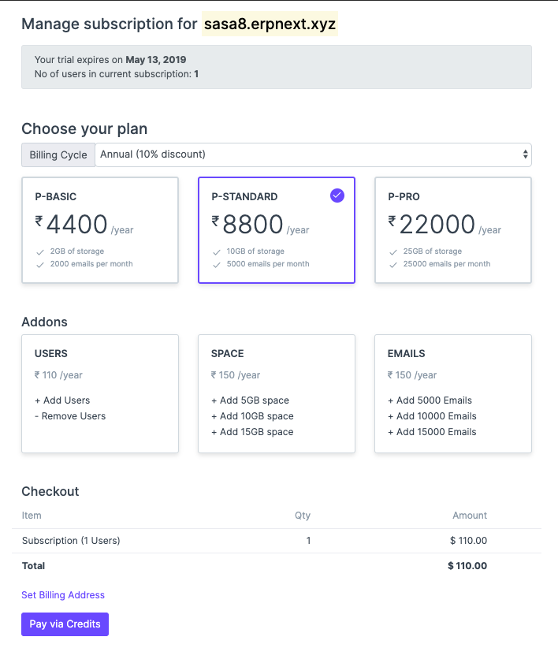
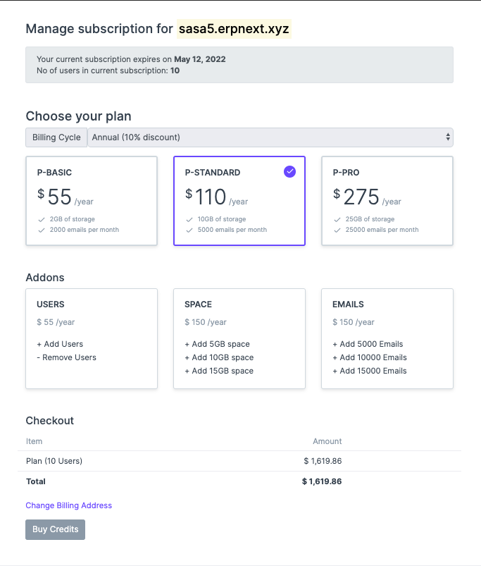
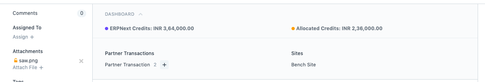
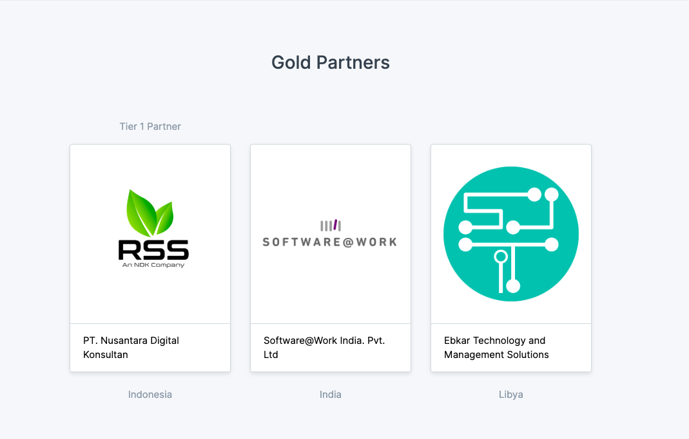

---?color=linear-gradient(to right, #009fff, #ec2f4b)
@title[Introduction]

@snap[west text-25 text-bold text-white]
Open Day *May 2019*
@snapend

@snap[south-west byline text-white text-06]
By Deepesh Garg
@snapend

---

#### Credit allocation with new payment page

---

#### Credit allocation with new payment page

---

#### Dashboard and indicators for ERPNext Partner doctype

---

##### Minor changes in partner Listing

---

##### Accountng Dimensions

---

##### Documentation for chart of accounts importer

---

@snap[north-west]
Dashboards for doctypes in accounts module
@snapend

@snap[west list-content-custom span-100]
@ol[list-bullets-black](false)
- Bank
- Bank Account
- Finance Book
- Fiscal Year
- Item Tax Template
- Loyalty Program
- Monthly Distribution
- POS Profile
- Share Holder
- Tax Category
@olend
  
@snapend

---

@snap[north-west]
Support Issues + Bug Fixes
@snapend

@snap[west list-content-custom span-100]
@ol[list-bullets-black](false)
- Missing translations in AR report
- GSTR-1 Report fixes for 0% taxable items
- Lead Owner report query and column fixes
- Stock Reconciliation fix for serialized and batch items
- Item variant creation fix based on manufacturer
- Test case for return in Purchase
- Filtering issue fix in datatable
- Printing and PDF issue in query reports
- Auto Email Support for Custom Reports
@olend
  
@snapend

---

@snap[text-25 text-bold]
Thanks
@snapend

