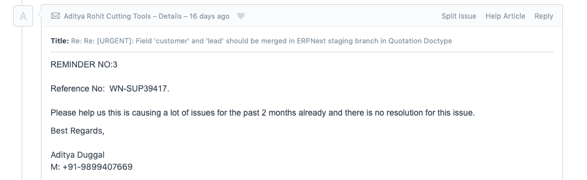
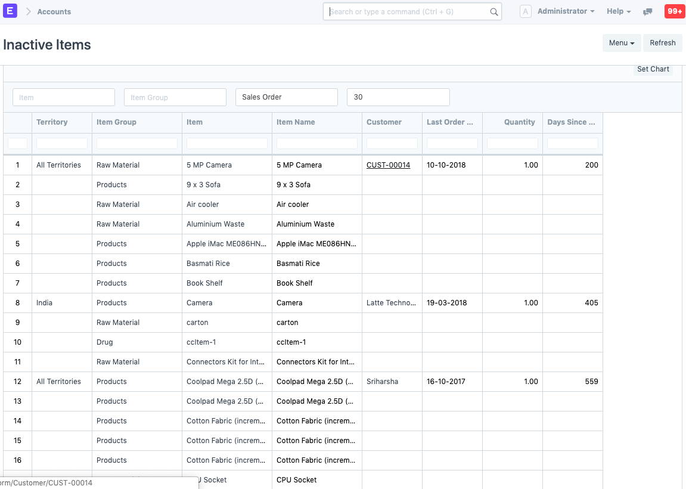
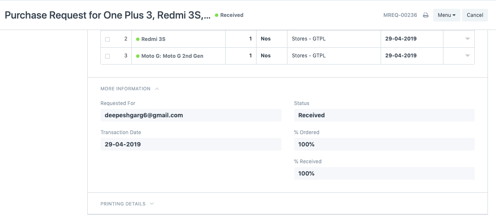
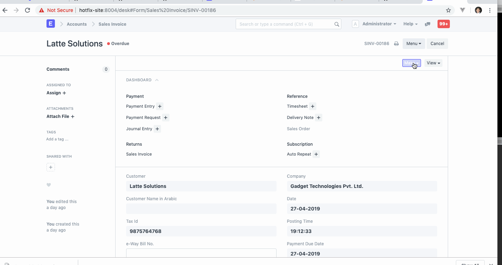
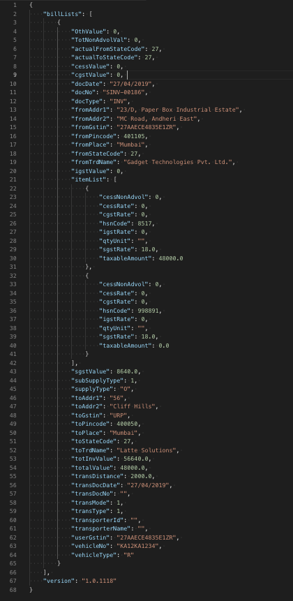
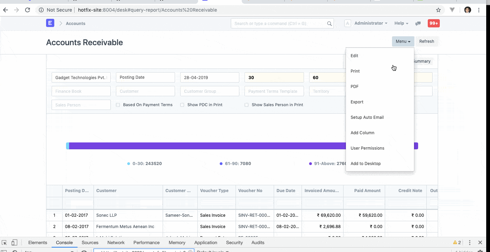
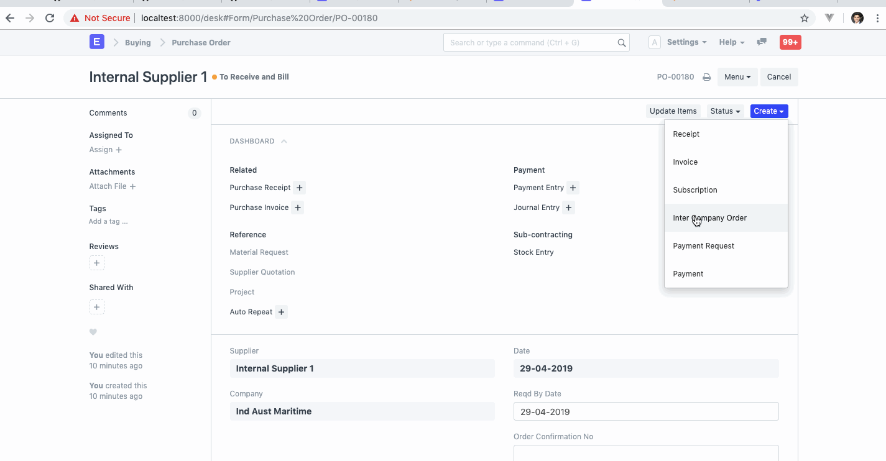

---?color=linear-gradient(to right, #009fff, #ec2f4b)
@title[Introduction]

@snap[west text-25 text-bold text-white]
Open Day<br>*April 2019*
@snapend

@snap[south-west byline text-white text-06]
By Deepesh Garg
@snapend

---
@snap[north-west]
Partner Portal post release Activities
@snapend

@snap[west list-content-concise span-100]
@ol[list-bullets-black](false)
- Image upload button fix in partner profile webfrom
- Minor changes and fixes in partner listing page and plans page
- Partner credit balance report
- Changes in signup form
- Remove old reseller pages
@olend
<br><br>
@snapend

---
#### Merge Lead and Customer field into a Dynamic Field for Quotation and Opportunity



---

##### New Inactive Items Report




---

##### [ICP India] Notification of Receipt against Material Request


---

##### [ICP India] Notification of Receipt against Material Request




---


#### E-way bill json creation creation and download



---


##### Sample JSON



---


##### Addition of custom fields to Script and Query reports




---


##### [Wallbox] Automatic PO - SO Creation in Inter-company Transactions




---
@snap[north-west]
Patch for Sapcon
@snapend

```python
	import frappe
	from erpnext.stock.stock_balance import repost_stock
	from erpnext.stock.utils import get_bin

	def execute():

		item_set = set()

		for table in ["Sales Order", "Purchase Order", "Material Request", "Work Order"]:
			warehouse = 'i.source_warehouse' if table == 'Work Order' else 'i.warehouse'
			item_details = frappe.db.sql("""select i.item_code, {warehouse} as warehouse
				from `tab{table} Item` i, `tab{table}` s where i.parent = s.name and
				s.docstatus = 1 """.format(table = table, warehouse = warehouse), as_dict=1)

			for item in item_details:
				item_set.add((item.item_code, item.warehouse))

		sle = frappe.db.sql("select item_code, warehouse from `tabStock Ledger Entry` where docstatus = 1", as_dict=1)

		for items in sle:
			item_set.add((item.item_code, item.warehouse))

		packed_items = frappe.db.sql("select item_code, warehouse from `tabPacked Item` ", as_dict=1)

		for items in packed_items:
			item_set.add((item.item_code, item.warehouse))


		for item in item_set:
			repost_stock(item[0], item[1])
			bin_obj = get_bin(item[0], item[1])
			bin_obj.update_reserved_qty_for_production()
			bin_obj.update_reserved_qty_for_sub_contracting()
```

---
@snap[north-west]
Support Issues + Bug Fixes
@snapend

@snap[west list-content-custom span-100]
@ol[list-bullets-black](false)
- RTL scrolling issue fix in datatable (Bug Sprint meetup)
- Query Report not being reloaded when route options are passed
- Custom doctype remaning issue fix
- Stock ledger report issue fix when warehouse filter is applied
- Minor fixes in GSTR-3b Report
- Datatype fix balance(account currency) in General Ledger (v10.x.x)
- GSTR-1 B2C Small Report issue fix
- Party type validation in Payment Entry
- TDS payable monthly report fix
@olend
<br><br>
@snapend

---

@snap[text-25 text-bold]
Reviewed 10-15 pull requests
@snapend

---

@snap[text-25 text-bold]
Thanks
@snapend


